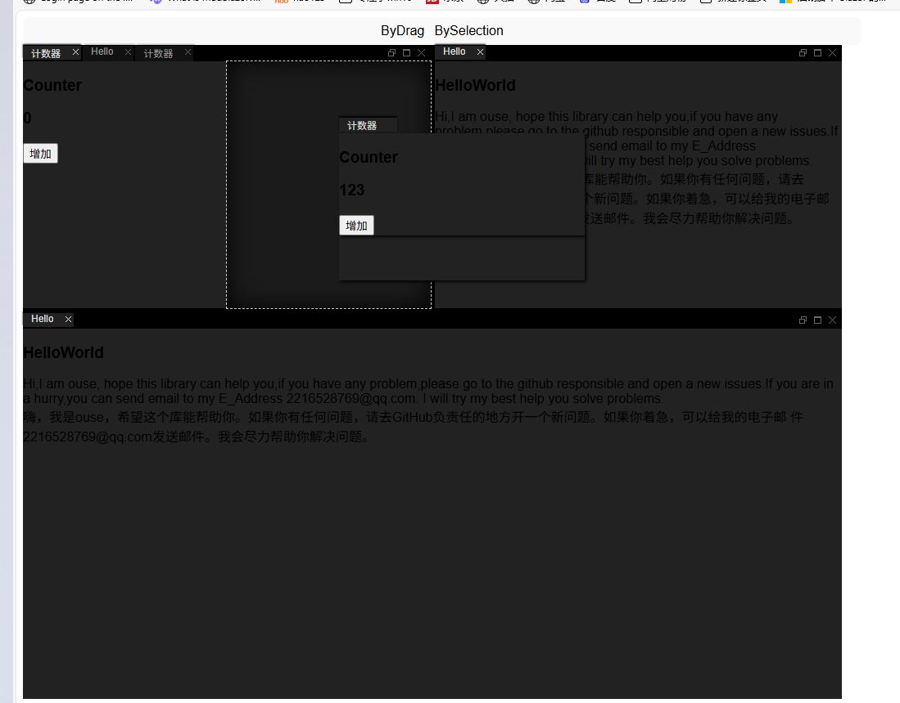

👉 [查看中文文档](README_cn.md)

### Hello, I’m Ouse. Welcome to this repository!

This is a Blazor wrapper library for [goldenlayout.js](https://golden-layout.com/).
 Special thanks to the GoldenLayout development team for their incredible work!

x

### 🛠️ Quick Start

#### 1. Install the NuGet package

```bash


NuGet\Install-Package Blazor.GoldenLayout -Version 1.0.0
```

------

#### 2. Add the desired theme to your `index.html` (for Blazor Wasm) or `App.razor` (for Blazor Web App)

> This library includes two built-in light and dark themes.
>  The required JS files for GoldenLayout will be dynamically injected when needed.
>  You only need to manually include the theme CSS.

**`index.html` example:**

```html
<!DOCTYPE html>
<html lang="en">
<head>
    <meta charset="utf-8" />
    <meta name="viewport" content="width=device-width, initial-scale=1.0" />
    <title>GoldenLayoutTest</title>
    <base href="/" />
    <link rel="stylesheet" href="css/app.css" />
    <link rel="icon" type="image/png" href="favicon.png" />
    <link href="GoldenLayoutTest.styles.css" rel="stylesheet" />
    <!-- Add theme CSS here -->
    <link type="text/css" rel="stylesheet" href="_content/Blazor.GoldenLayout/goldenlayout-dark-theme.css" />
</head>
<body>
    <div id="app">
        <svg class="loading-progress">
            <circle r="40%" cx="50%" cy="50%" />
            <circle r="40%" cx="50%" cy="50%" />
        </svg>
        <div class="loading-progress-text"></div>
    </div>

    <div id="blazor-error-ui">
        An unhandled error has occurred.
        <a href="" class="reload">Reload</a>
        <a class="dismiss">🗙</a>
    </div>

    <script src="_framework/blazor.webassembly.js"></script>
</body>
</html>
```

**`App.razor` example:**

```html
<head>
    <meta charset="utf-8"/>
    <meta name="viewport" content="width=device-width, initial-scale=1.0"/>
    <base href="/"/>
    <link rel="stylesheet" href="@Assets["lib/bootstrap/dist/css/bootstrap.min.css"]"/>
    <link rel="stylesheet" href="@Assets["app.css"]"/>
    <link rel="stylesheet" href="@Assets["BlazorServer_Test.styles.css"]"/>
    <ImportMap/>
    <link rel="icon" type="image/png" href="favicon.png"/>
    <HeadOutlet/>
    <!-- Add theme CSS here -->
    <link type="text/css" rel="stylesheet" href="_content/Blazor.GoldenLayout/goldenlayout-dark-theme.css" />
</head>
<body>
    <Routes @rendermode="@(new InteractiveServerRenderMode(prerender:false))"/>
    <script src="_framework/blazor.web.js"></script>
</body>
```

------

#### 3. Register required services

**For Blazor WebAssembly:**

```csharp
using Blazor.GoldenLayout;
using GoldenLayoutTest;
using GoldenLayoutTest.Pages;
using Microsoft.AspNetCore.Components.Web;
using Microsoft.AspNetCore.Components.WebAssembly.Hosting;

var builder = WebAssemblyHostBuilder.CreateDefault(args);
builder.RootComponents.Add<App>("#app");
builder.RootComponents.Add<HeadOutlet>("head::after");

builder.Services.AddScoped(sp => new HttpClient { BaseAddress = new Uri(builder.HostEnvironment.BaseAddress) });

// Register GoldenLayout
builder.Services.RegisterGoldenLayoutService(new Dictionary<Type, string>
{
    { typeof(Counter), "Counter" },
    { typeof(HelloWorld), "HelloWorld" },
});
builder.RootComponents.RegisterGoldenLayoutComponent();

await builder.Build().RunAsync();
```

**For Blazor Server:**

```csharp
using Blazor.GoldenLayout;
using BlazorServer_Test.Components;
using BlazorServer_Test.Components.Pages;
using Microsoft.AspNetCore.Components.Web;

var builder = WebApplication.CreateBuilder(args);

builder.Services.AddRazorComponents()
    .AddInteractiveServerComponents();

// Register GoldenLayout
builder.Services.RegisterGoldenLayoutService(new Dictionary<Type, string>
{
    { typeof(Counter), "Counter" },
    { typeof(HelloWorld), "HelloWorld" },
});

builder.Services.AddServerSideBlazor(options =>
{
    options.RootComponents.RegisterGoldenLayoutComponent();
});

var app = builder.Build();

if (!app.Environment.IsDevelopment())
{
    app.UseExceptionHandler("/Error", createScopeForErrors: true);
    app.UseHsts();
}

app.UseHttpsRedirection();
app.UseAntiforgery();

app.MapStaticAssets();
app.MapRazorComponents<App>()
    .AddInteractiveServerRenderMode();

app.Run();
```

------

#### 4. Disable prerendering (if enabled)

GoldenLayout components require coordination between parent-child relationships that rely on cascade parameters and asynchronous initialization. When prerendering is enabled, it may cause mismatched rendering sequences and inconsistent states.
 For now, please disable prerendering globally as shown below:

```
razor <body>
<Routes @rendermode="@(new InteractiveServerRenderMode(prerender:false))"/>
<script src="_framework/blazor.web.js"></script>
</body>
```

------

#### 5. You're ready to go! 🎉

This project supports both **Razor component-based** and **code-based** configuration styles.

> ⚠️ When using Razor component-based configuration, `ContentItem` defined in external code via `GoldenLayoutConfiguration` will be ignored.

------

### 🧩 Razor Component Configuration

```
razor <div style="width:1000px;display: flex; gap: 12px; padding: 8px 12px; justify-content: center; background-color: #f9f9f9; border-radius: 8px; align-items: center;">
    <GoldenLayoutSpawnerItem ContentItem="_counter">ByDrag</GoldenLayoutSpawnerItem>
    <GoldenLayoutSpawnerItem ContentItem="_hello" SpawnerType="GoldenLayoutSpawnerType.BySelection">BySelection</GoldenLayoutSpawnerItem>
</div>

<GoldenLayout Style="width:1000px;height:800px" GoldenLayoutConfiguration="_configuration" SelectionChangedCallback="SelectionChangedCallback">
    <GoldenLayoutRow Title="Row">
        <GoldenLayoutStack>
            <GoldenLayoutComponent ComponentName="Counter" Title="Counter" />
            <GoldenLayoutComponent ComponentName="HelloWorld" Title="Hello" />
            <GoldenLayoutComponent ComponentName="Counter" Title="Counter" />
        </GoldenLayoutStack>

        <GoldenLayoutComponent ComponentName="HelloWorld" Title="Hello" />
        <GoldenLayoutComponent ComponentName="HelloWorld" Title="Hello" />
    </GoldenLayoutRow>
</GoldenLayout>
```

------

### 🧱 Code-Based Configuration

```razor
@page "/SimpleExample"
@using Blazor.GoldenLayout
<PageTitle>SimpleExample</PageTitle>

<GoldenLayout Style="width:600px;height:400px" GoldenLayoutConfiguration="layoutConfig" />

@code {
    private GoldenLayoutConfiguration layoutConfig = new GoldenLayoutConfiguration
    {
        Content = new List<ContentItem>
        {
            new ContentItem
            {
                ContentType = ContentType.Row,
                Content = new List<ContentItem>
                {
                    new ContentItem
                    {
                        ContentType = ContentType.Component,
                        ComponentName = "Counter",
                        Title = "Counter",
                        ComponentState = new Dictionary<string, object> { { "Cnt", 123 } }
                    },
                    new ContentItem
                    {
                        ContentType = ContentType.Component,
                        ComponentName = "Counter",
                        ComponentState = new Dictionary<string, object> { { "Cnt", 100 } }
                    },
                    new ContentItem
                    {
                        ContentType = ContentType.Component,
                        ComponentName = "Counter",
                        ComponentState = new Dictionary<string, object> { { "Cnt", 10 } }
                    }
                }
            }
        }
    };
}
```

------

### 📚 How It Works

Coming soon...

------

### 📖 API Reference

Coming soon...

------

### 🚀 Roadmap

- Add more API wrappers
- Publish documentation on GitHub Pages
- Solve prerendering-related issues
